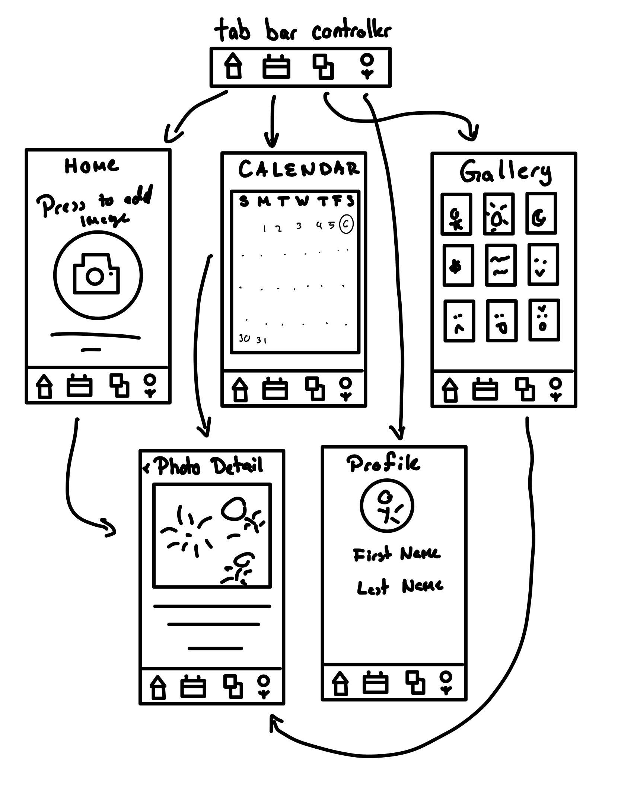

# ios-capstone-project-gp
Original App Design Project - README Template
===

# An Image A Day

## Table of Contents

1. [Overview](#Overview)
2. [Product Spec](#Product-Spec)
3. [Wireframes](#Wireframes)
4. [Schema](#Schema)

## Overview

### Description
An app that allows users to capture and save one highlight photo each day, creating a personal digital scrapbook and encouraging daily reflection.

### App Evaluation

[Evaluation of your app across the following attributes]
- **Category:** Lifestyle / Journaling

- **Mobile:** Uses the camera, push notifications, and calendar view for a uniquely mobile experience

- **Story:** Encourages mindfulness by capturing a meaningful moment every day

- **Market:** Appeals to students, young adults, and anyone interested in photo journaling or memory keeping

- **Habit:** Highly habit-forming through daily check-ins and streak tracking

- **Scope:** includes a calendar, photo uploads, and gallery; optional features like captions, tags, or exporting albums can be added later

## Product Spec

### 1. User Stories (Required and Optional)

**Required Must-have Stories**

* User can take or upload one photo per day
* User can view their photos in a calendar format
* User can set daily reminders/notifications
* User can browse their gallery of past photos

**Optional Nice-to-have Stories**

* User can add captions or tags to photos
* User can export or share their scrapbook
* User can track streaks
* User can search/filter photos by tags or mood

### 2. Screen Archetypes
- **Home Screen**
  * Add or upload today’s photo
  * View reminder for daily entry
- **Calendar Screen**
  * See daily photo entries in a calendar layout
  * Tap a date to view that day’s photo
- **Gallery Screen**
  * Scroll through all saved photos in a feed/grid
  * Tap photo for details
- **Photo Detail Screen**
  * View a larger version of a photo
  * See optional caption or tags
- **Profile/Settings Screen**
  * Adjust notifications, streaks, and app settings

### 3. Navigation

**Tab Navigation** (Tab to Screen)

* Home
* Calendar
* Gallery
* Profile

**Flow Navigation** (Screen to Screen)

- **Home Screen**
  * → Add Photo (Camera or Upload) → Save → Home
- **Calendar Screen**
  * → Tap a Date → Photo Detail
- **Gallery Screen**
  * → Tap Photo → Photo Detail
- **Photo Detail Screen**
  * → Back to Calendar or Gallery
- **Profile Screen**
  * → Edit Settings → Save → Profile

## Wireframes

[Add picture of your hand sketched wireframes in this section]

### [BONUS] Digital Wireframes & Mockups

### [BONUS] Interactive Prototype

## Schema 

[This section will be completed in Unit 9]

1: Activity 1 - Brainstorm
2: Activity 2 - Wireframe
3: Setting up the Xcode with tab bar
4: Making it functional

### Models

**Photo**
- photoID: String  
  Unique ID for the photo  
- date: Date  
  The date the photo was added  
- imageURL: File  
  The stored image file  
- caption: String (Optional)  
  User written caption for the photo  
- tags: Array (Optional)  
  Tags to help filter/search photos  

### Networking

- [Add list of network requests by screen ]
- [Create basic snippets for each Parse network request]
- [OPTIONAL: List endpoints if using existing API such as Yelp]

- - **Home Screen**
  * (Create/POST) Upload daily photo
- **Calendar Screen**
  * (Read/GET) Fetch all photo entries by date
- **Gallery Screen**
  * (Read/GET) Fetch photo list
- **Profile Screen**
  * (Update/PUT) Update user settings (notifications, streaks)
